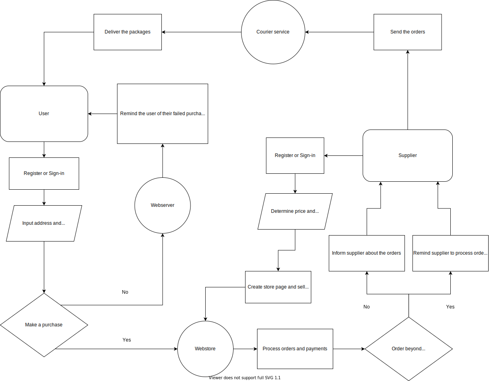

# Solutions

## Basic Concepts

1. Coding
    - A common example of code smell is a large, bloated class that usually has more than one purpose as it violates the first SOLID principle, which states that a class should have only one job. To prevent such bloated class is by keeping the class small and use a short and clear class name that describes the intent of such class.
    - Dependency Injection (DI) is a technique where an object (client) delegates the creation of its dependencies (services) to another object (injector). DI is an instrument of the fifth SOLID principle, the dependency inversion principle, which states that entities must depend on abstractions, not on concretions. It reduces boilerplates of creating services, enables changing services at runtime, and makes extending the application easier.
2. REST API
    - POST
        - Do's:
            - A response to POST request should return HTTP status 201 and a 'Location' header with a link to the newly created resource on successful resource creation.
        - Don'ts:
            - POST requests should not be used for non-idempotent requests, e.g., for 'update' resource requests as specified in the HTTP specifications.
    - GET
        - Do's:
            - GET requests should be cacheable: if other requests have yet to modify the specified resource, the GET request itself should be cacheable, saving the server a new request.
        - Don'ts:
            - GET requests should not modify the server state: HTTP methods except for POST should be idempotent, which means if you make a request several times, they should have the same effect, i.e., they should not change the state of the server.

## Basic Coding

Each product has an id or tag that can be used to differentiate the order to be sent by each seller.

## Algorithm

1. Please see [sock_merchant.go](cmd/sock_merchant/sock_merchant.go).

2. Please see [counting_valleys.go](cmd/counting_valleys/counting_valleys.go).

3. Please see [print_digits.go](cmd/print_digits/print_digits.go).

4. Please see [lamp_switch.go](cmd/lamp_switch/lamp_switch.go).
